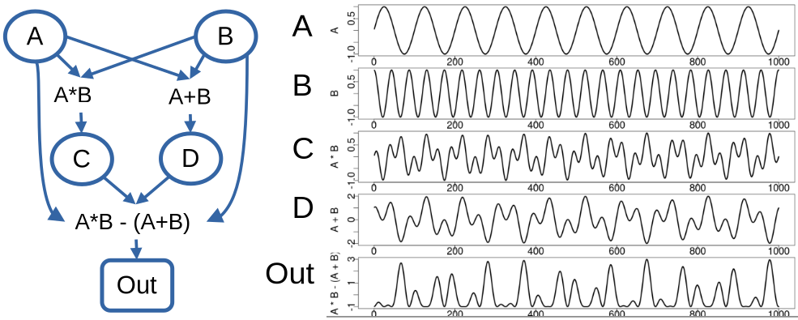
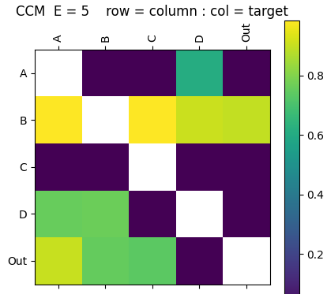
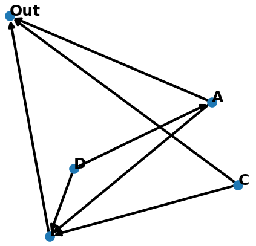

## GMN Example

A simple example demonstrates the processing pipeline on a toy data set. The network consists of 5 nodes: `A B C D Out`. Each node represents a time series of length 1000 points with network structure and time series:



---

### Interaction Matrix
The interaction matrix defines the GMN network created with the `InteractionMatrix.py` application (see [Interaction Matrix](overview.md)). Help can be shown with the `-h` argument. We create the interaction matrix from data file `TestData_ABCD.csv` using the EDM convergent cross mapping (CCM) metric, storing the output interaction matrix in `ABCD_iMatrix_E5_tau-3_CCM.csv`.  CCM is passed an embedding dimension of E=5, and time delay of tau=-3. 

```python
./apps/InteractionMatrix.py -d ./data/TestData_ABCD.csv -oc ./output/ABCD_iMatrix_E5_tau-3 -ccm -E 5 -t -3 -P

```

<!--  -->


### Network Creation
The `CreateNetwork.py` application (see [Create Network](overview/)) reads the interaction matrix and creates the `networkx` directed graph object, here stored in a binary file using the python pickle module.

```python
./apps/CreateNetwork.py -i ./output/ABCD_iMatrix_E5_tau-3_CCM.csv -t Out -o ./output/ABCD_Network_E5_tau-3_CCM.pkl -d 4 -P -l spring
```

<!--  -->

---

### Generative Mode
With a GMN network we can run GMN in generative mode according to the parameters specified in a configuration file (see [Parameters](parameters.md)). `[EDM]` parameters are defined in [EDM Parameters](https://sugiharalab.github.io/EDM_Documentation/parameters/).

Define the configuration file `./network/ABCD_Out.cfg` as :

```config
[GMN]
mode             = Generate
predictionStart  = 700
predictionLength = 300
backend          = serial
kernel           = True
outPath          = ../output
dataOutFile      =
showPlot         = True
plotType         = state
plotColumns      = Out A B C D
plotFile         =

[Network]
name       = ABCD 4 Driver
targetNode = Out
file       = ./network/ABCD_Test/ABCD_Network_E3_T0_tau-1_CMI.pkl
data       = ./data/TestData_ABCD.csv

[Node]
info       = EDM Simplex Manifolds
function   = Simplex

[EDM]
E        = 7
Tp       = 1
tau      = -3
validLib = 

[Scale]
factor = 1
offset = 0
```

From the python console import the gmn package, create the GMN object and run the network in generative mode:

```python
import gmn

G = gmn.GMN( configFile = './config/ABCD_Out.cfg' )

G.Generate()

G.DataOut.tail( 5 )
     Time       A       C       D         B       Out
295   996 -0.2487 -0.5018  0.7500  0.985236 -0.979370
296   997 -0.1874 -0.4708  0.7937  0.985842 -0.991504
297   998 -0.1253 -0.4248  0.8177  0.965066 -0.973041
298   999 -0.0628 -0.3671  0.8224  0.923630 -0.931681
299  1000  0.0000 -0.3016  0.8090  0.862222 -0.871642

The output state plot shows the library (observed time series & state-space) in blue, and GMN generated values in orange.

<center></center>
